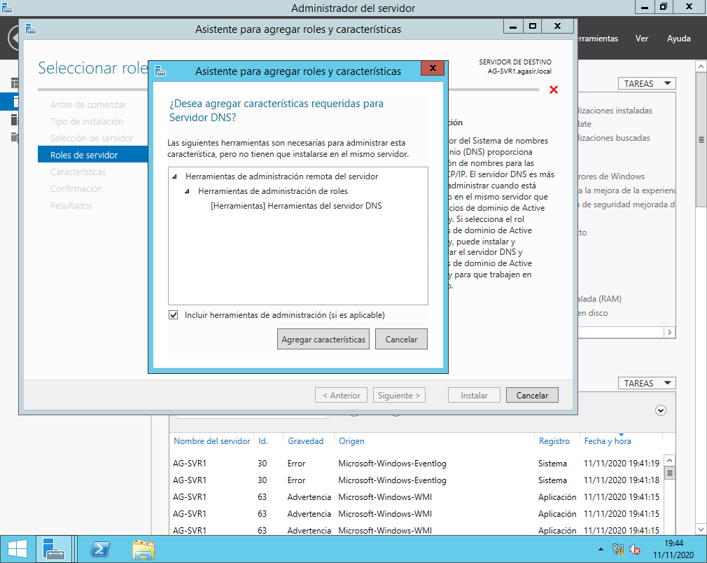
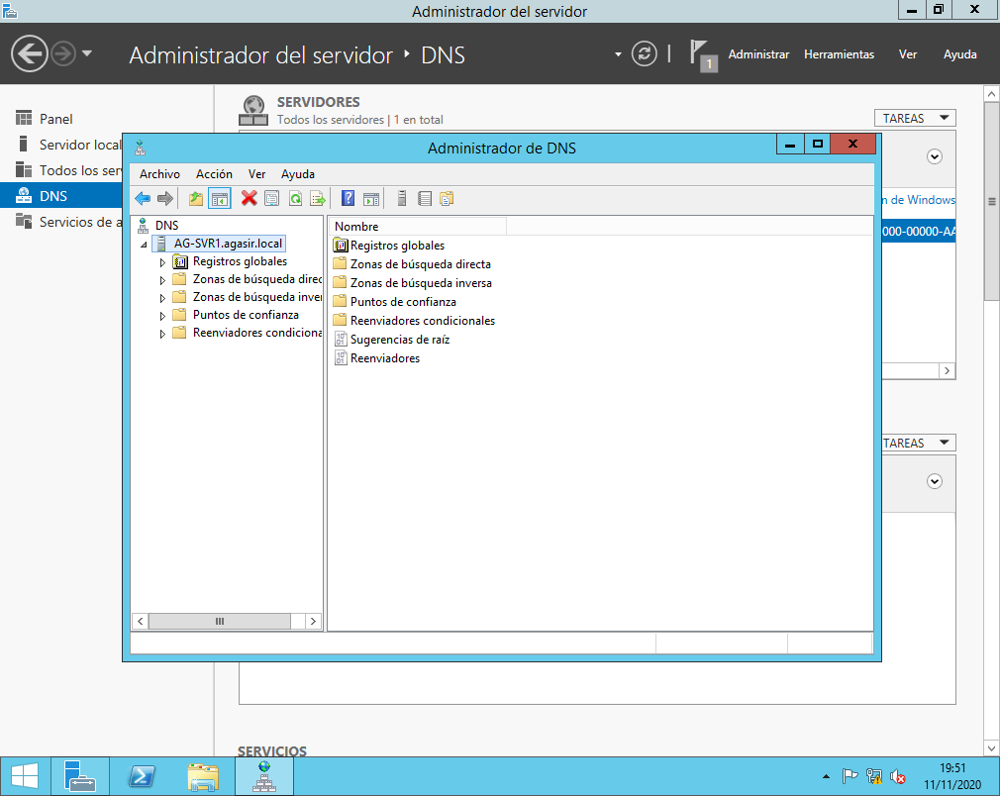

# SRI-PRÁCTICA 01 - DNS en Windows Server
> IES Celia Viñas (Almería) - Curso 2020/2021  
> Módulo: SRI - Servicios de Red e Internet  
> Ciclo: CFGS Administración de Sistemas Informáticos en Red  

## CONFIGURACIÓN PREVIAS
Siguiendo la configuración de máquinas virtuales que vimos en el tema inicial, vamos a configurar un servidor DNS en la máquina de Windows 2019 server.

> IMPORTANTE: Debido a que el servidor que vamos a instalar es independiente a los nombres de dominio que se establecen con Active Directory, para no tener problemas, vamos a desinstalar todos los roles y características de Active Directory. Recomendación: Instalar un nuevo servidor (aunque se pierda también el DHCP, no es muy importante ya que para establecer nombres en un dominio es recomendable que las IP’s sean fijas) 

## Punto 2. INSTALAR SERVICIO 
1. Instalar servidor de DNS en vm-2019 server si no lo está aún. 



Imagen 1.  Instalación del ROL DNS

2. En administración del servidor. Agregar roles y características. Servidor DNS. 



Imagen 2.  ROL DNS

## Punto 3. EJERCICIOS 
1. Utilizar el servidor como sólo caché. Por defecto, al instalar el servicio DNS, este actúa como sólo caché, es decir, no es autorizado a ninguna zona) y responde a consultas recursivas. 

a. Configura el cliente windows y ubuntu con ip fija y que tengan como servidor DNS la dirección del servidor. 

b. En windows usa la orden nslookup y realiza consultas a diversos dominios de internet (www.google.es, www.mec.es, www.ual.es …) 

c. Activa la vista avanzada en el servidor y consulta la caché, busca los nombres por los que has preguntado y al ser consultas recursivas hay más información. 

d. En ubuntu y con la orden dig realiza las siguientes pruebas: 
```bash
dig [@servidorDNS] NombreDominioAConsultar [tipoConsulta] 
#dig @TuIPServidorDNS google.es (Consulta tipo A: la ip de google.es) #dig @TuIPServidorDNS google.es a (Consulta tipo A: la ip de google.es) #dig @TuIPServidorDNS google.es ns (servidores de DNS de google.es) 
#dig @TuIPServidorDNS google.es mx (servidores de correo de google.es) #dig @TuIPServidorDNS google.es soa (consulta l registro de la zona google.es) 
#dig @TuIPServidorDNS google.es any (Todas las consultas a,ns,mx,soa,...) #dig @TuIPServidorDNS -x 193.147.117.38 (consulta inversa IP --> nombre) 
```

2. Crear y configurar el servidor como primario en una zona de resolución directa. 

a. Vamos a crear una zona para nuestra red local que se llamará: tunombre.sri 

b. Debemos cambiar el sufijo DNS del equipo a este dominio que vamos a crear (esta opción se cambia donde se cambia el nombre del equipo pulsado el botón Más) 

c. En el administrador de DNS, sobre zonas de búsqueda directa crearemos una nueva zona (tunombre.sri) 

d. En el registro de inicio de autoridad (SOA) establece los siguientes valores: 
➢ Nombre del servidor principal para que sea ns.tunombre.sri 
➢ Contacto: tunombre.tunombre.sri  
➢ Actualización: 5 horas.  
➢ Reintento: 3 horas.  
➢ Expira: 14 días.  
➢ TTL mínimo: 10 horas.  

e. En el registro servidores de nombre (NS) borramos los que nos aparecen y configuramos uno nuevo que sea ns.tunombre.sri y que tenga las ip’s del servidor (de las dos tarjetas de red).

f. Establece los registros de tipo A para las siguientes direcciones: 
➢ tunombre.sri → la IP de tu máquina anfitriona.  
➢ pcXX.tunombre.sri → 192.168.22.X (dónde XX es la IP de un compañero)  
➢ router.tunombre.sri → 192.168.22.100 (Ip del router)  
➢ win.tunombre.sri → 10.0.X.X (ip de tu máquina cliente windows)  
➢ ubuntu.tunombre.sri → 10.0.X.X (ip de tu máquina cliente ubuntu)  

g. Establece los siguientes registros de alias (CNAME): 
➢ mail → a la máquina ubuntu  
➢ ftp → al router  
➢ www → a tunombre.sri (máquina anfitriona)  
➢ nombrecompañero → a la máquina del compañero.  

h. Establece el registro para servidor de correo (MX) 
➢ tunombre.sri(No poner nada en host) → mail (ubuntu)  

3. Configurar zonas de resolución inversa para las dos subredes de trabajo y que resuelva cada una de las IP’s establecidas (192.168.22 y 10.0.X) 

4. Mirar los archivos de zona que ha generado windows (los de resolución directa e inversa) y ábrelos con el bloc de notas. 

5. Configurar redireccionadores de dns a 8.8.8.8 8.8.4.4 (servidores de dns que resuelven nombres que no están en las zonas de nuestros servidor dns). Está en propiedades servidor de dns. 

6. Comprobar en cliente Ubuntu (debe estar configurado con ip fija) el funcionamiento del servidor DNS en el dominio de cada uno tunombre.sri con el comando dig. a. Que resuelve todos los nombres y alias. 

b. Que resuelve dominio externos. 

c. Que hace resolución inversa. 

## REFERENCIAS

